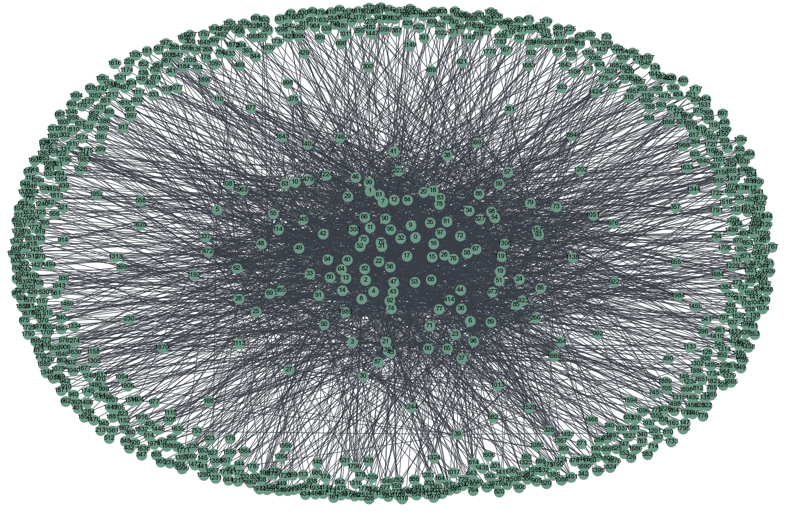

# Recommendation System

## Objective

This project aims to train a Machine learning model to learn the user's preferences from the Movies rating dataset and then recommend a movie for any user based on its learning. As this project deals with the huge dataset, big data tools like Spark framework has been leveraged.

## Dataset

The dataset used in this project is fetched from [MovieLens 20M Dataset](https://www.kaggle.com/datasets/grouplens/movielens-20m-dataset)

The datasets describe ratings and free-text tagging activities from MovieLens, a movie recommendation service. It contains 20000263 ratings and 465564 tag applications across 27278 movies. These data were created by 138493 users between January 09, 1995 and March 31, 2015. This dataset was generated on October 17, 2016.Users were selected at random for inclusion. All selected users had rated at least 20 movies.

## User to user Collaborative Filtering

User to User Collaborative Filtering is a kind of machine learning technique used to predict the items that a user  might like on the basis of ratings given to that item by the other users who have similar taste with that of the target user.

In this project, the users with similar taste of the user $i$ is referred as neighbors of user $i$. Each neighbor of user $i$ is referred as user $i^{\prime}$. We find the similarity score or the weight of the similarity between user $i$ and neighbor user $i^{\prime}$ is calculated as follows:

$$
w_{ii^{\prime}} =
    \frac{
            \sum\limits_{j\in\Psi_{ii^{\prime}}}
            (r_{ij} - \bar{r}_{i})
            (r_{i^{\prime}j} - \bar{r}_{i^{\prime}})
         }
         {
            \sqrt{\sum\limits_{j\in\Psi_{ii^{\prime}}} (r_{ij} - \bar{r}_{i})^2}
            \sqrt{\sum\limits_{j\in\Psi_{ii^{\prime}}} (r_{i^{\prime}j} - \bar{r}_{i^{\prime}})^2}
        }
$$

where,
* $\Psi_{i}$ set of movies that user $i$ has rated
* $\Psi_{i^{\prime}}$: set of movies that user $i^{\prime}$ has rated
* $\Psi_{ii^{\prime}}$ set of movies that both users $i$ and $i^{\prime}$ have rated
$$\Psi_{ii^{\prime}} = \Psi_{i} \cap \Psi_{i^{\prime}}$$
* $(r_{ij} - \bar{r}_{i})$ is the deviation score of the user's rating on the movie j from his/her average rating. This is because each user's interpretation of rating can be different. Hence, we focus on the deviation score for each movie rating to see how much it deviates from his average rating. 

The predicted rating score for a user $i$ on a movie $j$ is calculated as follows:

$$
S(i, j) = \bar{r}_{i} +
          \frac{\sum\limits_{i^{\prime}=\Omega_j}
          w_{ij} (r_{ij} - \bar{r}_{i^{\prime}})}
         {\sum\limits_{i^{\prime}=\Omega_j} |w_{ii^{\prime}}|}
$$

This score give an estimate of how much the user $i$ would have rated the movie $j$ based on the ratings of his/her weighted neighbors $i^{\prime} \in \Omega_{j}$ on movie $j$. 

The weighted relationship across each user's based on their similarity is depicted in a graph as follows:

